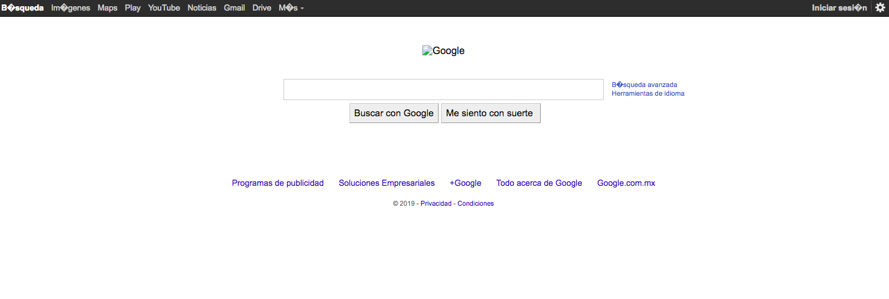

# Node Web Crawler

## Objectives

- To build a script to download webpages.
- To use concepts and skills such as core modules, CLI arguments, launching Node scripts,
using a module with npm.
- To make a GET request and processing body of HTML.
- To create a folder and a file with html data and url name.

## Sprints

1) Create project folder for this project. 

2) Create a `package.json` using `npm init -y`.

3) Install a module `uuid` for generating random timestamped values and naming folder.

4) Create a script file `download.js` which downloads a page when user gives an URL and writes page's HTML to a file. URL must be provided from the command-line argument.

    4.1) Import modules `http`, `fs`, `path` and `uuid` for creating a HTTP agent, a folder and a file, you'll be working with a folder/file path and generating random values.
    
    4.2) Create a function `downloadPage` which takes an URL, downloads HTML data from URL and saves the HTML into a new randomly created file.
    
        4.2.1) Create a unique folder name using 'npm module uuid'. It's important to use that folder name value to create a folder with `mkdirSync()`.
        
        4.2.2) Create a file 'file.html' into the new randomly created folder. Save HTML data. 
    
        4.2.3) Create a nested function 'fetchPage' which takes URL and a callback function and makes a GET request. Test function for getting html data once response has been completed.
    
            4.2.3.1) HTML page is sent as second argument of callback function once response has been completed. Test it.
            
            4.2.3.2) Catch error from GET request. Test it.
    
        4.2.4) Call 'fetchPage' function which takes the URL and a callback function. Logic to create files 'url.txt' and 'file.html' goes inside of the callback because GET method is asynchronous.


4.3) Call `downloadPage` method with the command line argument indicating a page URL. Launch script with some URL.

## Deliverables

- When you run download.js with a url…

```
$ node download.js http://www.google.com
downloading  http://www.google.com
downloading is done in folder 96ae25c0-18ea-11e9-bb33-a14938531f55
```

You'll have a folder '96ae25c0-18ea-11e9-bb33-a14938531f55' with html data 'data.html' and 'url.txt' with url name. 

- When you run 'data.html' looks like…




>  No worries about the browser view won't be a perfect copy, because there might be missing some CSS dependencies or AJAX/XHR content which is loaded on the fly by the target website but inaccessible by the GET request.
